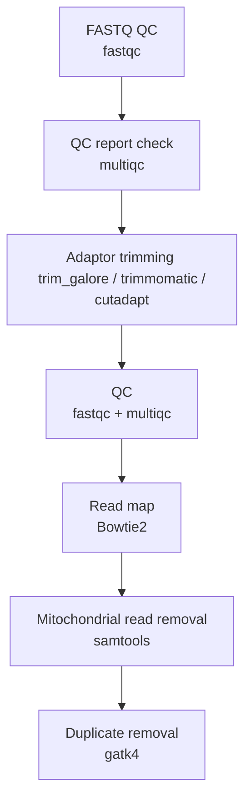

### This workflow is still ongoing and is being worked on in the master branch.

# ATACseq-pipeline_bash

This repository contains **bash scripts** for preprocessing ATAC-seq data starting from FASTQ files.

## Overview
The scripts automate common preprocessing steps for ATAC-seq analysis.  
All raw FASTQ files should be stored in the `data/fastq` directory before running the pipeline.

## Good to Know
1- Adaptor trimming:
There are three scripts available for adapter trimming:

- **Trimmomatic**
- **cutadapt**
- **trim_galore** *(default)*

By default, `trim_galore` is used in the pipeline.
If you prefer **Trimmomatic** or **cutadapt**, edit `pipeline.sh` and uncomment the corresponding lines.

2- Mapping reads against the reference genome:

Bowtie2 is used for this regard, for that the reference sequence must be indexed. So:
- **It is required that the reference genome be kept in the `ref/` directory with the `fa.gz` extension.**

## Usage
`bash pipline.sh`
This will auto execute all pre-processes below:

## Flowchart


## Usage
To execute all preprocessing steps in one go, simply run:

```bash
bash pipeline.sh

